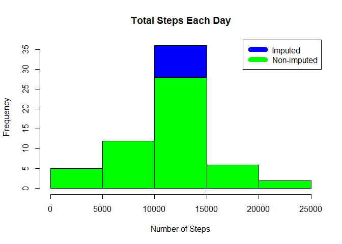

## Introduction

It is now possible to collect a large amount of data about personal movement using activity monitoring devices such as a Fitbit, Nike Fuelband, or Jawbone Up. These type of devices are part of the "quantified self" movement - a group of enthusiasts who take measurements about themselves regularly to improve their health, to find patterns in their behavior, or because they are tech geeks. But this data remains under-utilized because the raw data is hard to obtain and there are limited tools and statistical methods available for interpreting the data. 

This assignment makes use of data from a personal activity monitoring device. This device collects data at 5 minute intervals through out the day. The data consists of two months of data from an anonymous individual collected during the months of October and November, 2012 and include the number of steps taken in 5 minute intervals each day.


## Loading and preprocessing the data

The data for this assignment can be downloaded from the course web site: Dataset: [Activity monitoring data](https://d396qusza40orc.cloudfront.net/repdata%2Fdata%2Factivity.zip) [52K].

The variables included in this dataset are: 

steps: Number of steps taking in a 5-minute interval (missing values are coded as NA) 
date: The date on which the measurement was taken in YYYY-MM-DD format 
interval: Identifier for the 5-minute interval in which measurement was taken 

The dataset is stored in a comma-separated-value (CSV) file and there are a total of 17,568 observations in this dataset


```r
# Load data
if (!file.exists("activity.csv") )
    {
     dlurl <- 'http://d396qusza40orc.cloudfront.net/repdata%2Fdata%2Factivity.zip'  
     download.file(dlurl,destfile='repdata%2Fdata%2Factivity.zip',mode='wb')  
     unzip('repdata%2Fdata%2Factivity.zip')
    }

# Read data
data <- read.csv("activity.csv")  
```

## What is mean total number of steps taken per day?

Historgram of the total number of steps taken each day:


```r
steps_by_day <- aggregate(steps ~ date, data, sum)
hist(steps_by_day$steps, main = paste("Total Steps Each Day"), col="green",xlab="Number of Steps")
```

<!-- -->

Mean and median steps per day:


```r
rmean <- mean(steps_by_day$steps)
rmean
```

```
## [1] 10766.19
```

```r
rmedian <- median(steps_by_day$steps)
rmedian
```

```
## [1] 10765
```
The mean is 1.0766189\times 10^{4} and the median is 10765

## What is the average daily activity pattern?

Time Series Plot of the Average Number Steps per Day by Interval:


```r
steps_by_interval <- aggregate(steps ~ interval, data, mean)
plot(steps_by_interval$interval,steps_by_interval$steps, type="l", xlab="Interval", ylab="Number of Steps",main="Average Number of Steps per Day by Interval")
```

<!-- -->

The 5-minute interval that, on average, contains the maximum number of steps:


```r
max_interval <- steps_by_interval[which.max(steps_by_interval$steps),1]
max_interval
```

```
## [1] 835
```

The interval with most steps is 835

## Imputing missing values

Note that there are a number of days/intervals where there are missing values (coded as NA). The presence of missing days may introduce bias into some calculations or summaries of the data.

Total number of missing values in the dataset:


```r
NATotal <- sum(!complete.cases(data))
NATotal
```

```
## [1] 2304
```

The total number of missing values is 2304

We will use the mean for the day to fill in these missing values.


```r
StepsAverage <- aggregate(steps ~ interval, data = data, FUN = mean)
fillNA <- numeric()
for (i in 1:nrow(data)) {
    obs <- data[i, ]
    if (is.na(obs$steps)) {
        steps <- subset(StepsAverage, interval == obs$interval)$steps
    } else {
        steps <- obs$steps
    }
    fillNA <- c(fillNA, steps)
}
```
New dataset which fills in these missing values:


```r
new_activity <- data
new_activity$steps <- fillNA
```

Revised histogram of total steps taken each day:


```r
StepsTotalUnion <- aggregate(steps ~ date, data = new_activity, sum, na.rm = TRUE)
hist(StepsTotalUnion$steps, main = paste("Total Steps Each Day"), col="blue", xlab="Number of Steps")
#Create Histogram to show difference. 
hist(steps_by_day$steps, main = paste("Total Steps Each Day"), col="green", xlab="Number of Steps", add=T)
legend("topright", c("Imputed", "Non-imputed"), col=c("blue", "green"), lwd=10)
```

<!-- -->

Mean:


```r
rmeantotal <- mean(StepsTotalUnion$steps)
rmeantotal
```

```
## [1] 10766.19
```

Median:


```r
rmediantotal <- median(StepsTotalUnion$steps)
rmediantotal
```

```
## [1] 10766.19
```


Difference with the unadjusted dataset:

Median:


```r
rmediandiff <- rmediantotal - rmedian
rmediandiff
```

```
## [1] 1.188679
```

Mean:


```r
rmeandiff <- rmeantotal - rmean
rmeandiff
```

```
## [1] 0
```

The mean differs by 0 and the median by 1.1886792 


## Are there differences in activity patterns between weekdays and weekends?

Using the adjusted dataset, we can create a plot to compare the number of steps between the weekdays and the weekend.


```r
weekdays <- c("Monday", "Tuesday", "Wednesday", "Thursday", 
              "Friday")
new_activity$dow = as.factor(ifelse(is.element(weekdays(as.Date(new_activity$date)),weekdays), "Weekday", "Weekend"))
StepsTotalUnion <- aggregate(steps ~ interval + dow, new_activity, mean)
library(lattice)
xyplot(StepsTotalUnion$steps ~ StepsTotalUnion$interval|StepsTotalUnion$dow, main="Average Steps per Day by Interval",xlab="Interval", ylab="Steps",layout=c(1,2), type="l")
```

<!-- -->


